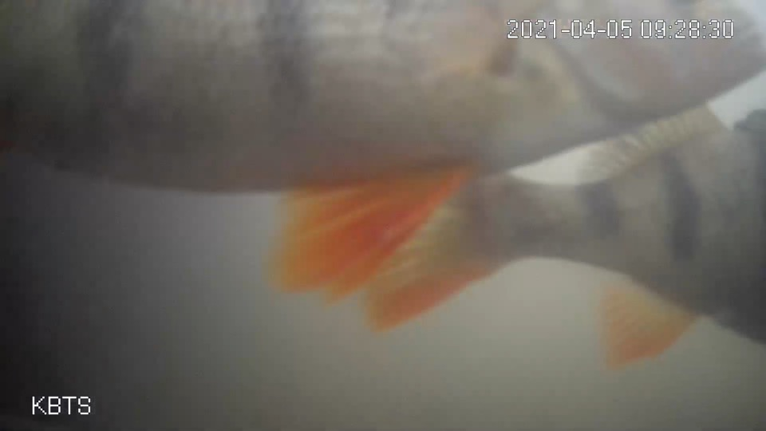
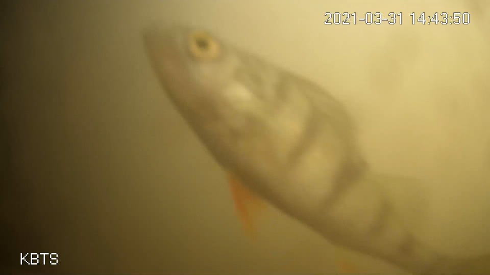
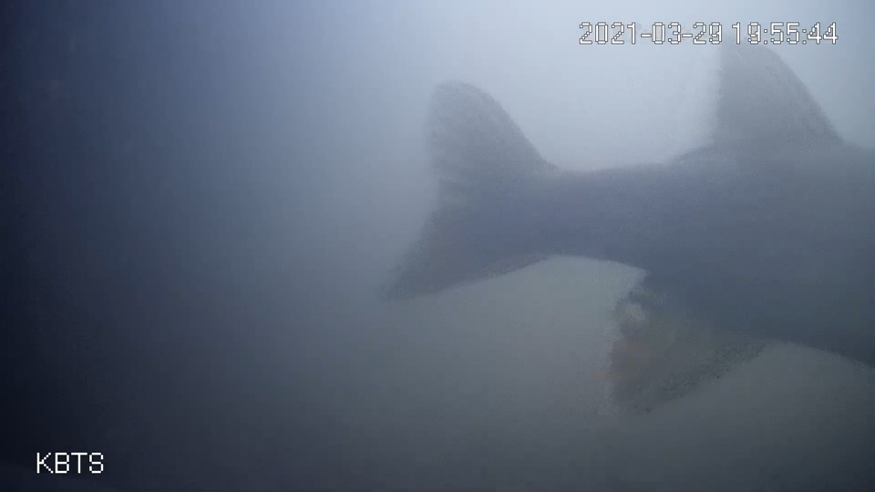
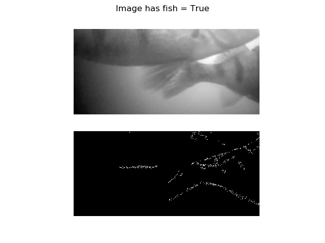
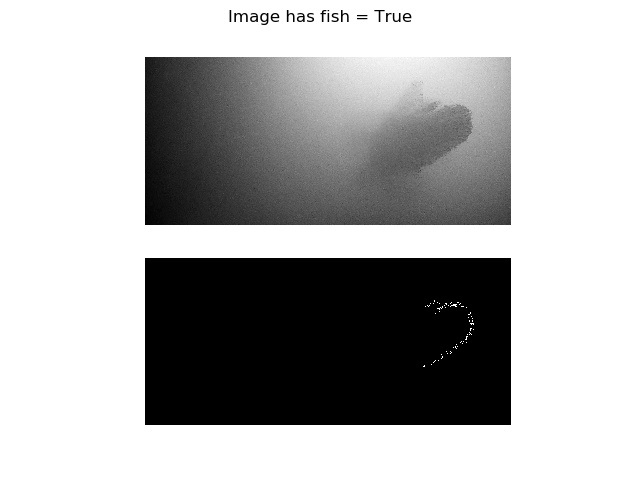
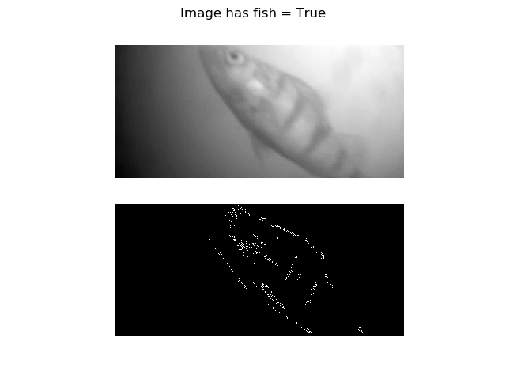
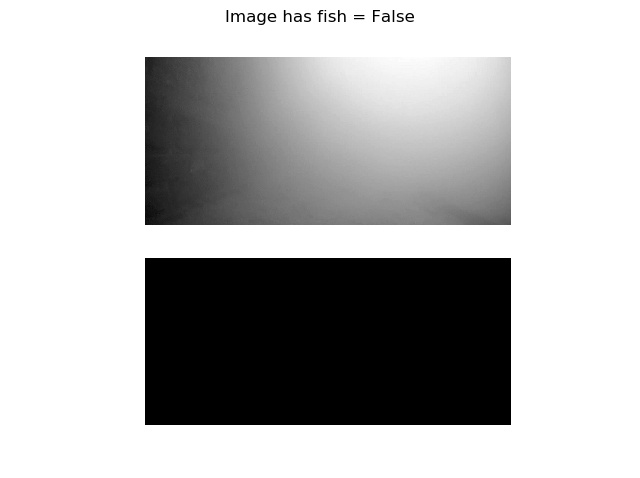

# Automating the Fish Doorbell with Computer Vision
🇳🇱: Automatiseren van de visdeurbel met computer vision

## Table of Contents
- [Automating the Fish Doorbell with Computer Vision](#automating-the-fish-doorbell-with-computer-vision)
  * [Table of Contents](#table-of-contents)
  * [What is the Fish Doorbell?](#what-is-the-fish-doorbell-)
  * [How it works](#how-it-works)
    + [On applying computer vision](#on-applying-computer-vision)
    + [Selecting a method for our fish](#selecting-a-method-for-our-fish)
    + [How the detector works.](#how-the-detector-works)
  * [Results](#results)
  * [Running the code yourself](#running-the-code-yourself)
  
## What is the Fish Doorbell?

## How it works
The doorbell is automated in `doorbell.py`. It runs the `run_doorbell_on_images()` definition, which itself runs `run_doorbell_on_image()` on every image that it encounters in a folder called `./images`.

### On applying computer vision
Detecting whether fish are present in an image is a classification problem with two classes: no fish present (0) or fish present (1). In computer vision, there are three broad classes for detecting fish, with their pros and cons:

1. **Supervised Learning** (ranging from simple ConvNet-based classifiers to YOLO-like object detection/segmentation models).
  * (+) Highly accurate if trained properly. Work well with relatively complex data space (e.g. with varying image backgrounds and such).
  * (-) Requires large datasets (preferably a few thousand images at minimum) that are also well-balanced. Requires human labeling which takes time and money.
2. **Self-Supervised Learning** (with approaches like RotNet) to generate feature extractors that can be used in downstream approaches.
  * (+) Can extract features that are most relevant to each class without supervision i.e. without the need for human labeling. Work well with relatively complex data space (e.g. with varying image backgrounds and such).
  * (-) Takes time. Requires additional downstream tinkering or supervised learning to work well on the classification task.
3. **Classic Computer Vision methods** (i.e. OpenCV-style).
  * (+) Doesn't require a lot of training data. Can work extremely well if environment is simple. Doesn't require any labeling.
  * (-) Doesn't work too well if environment is varied. Requires human understanding about what makes an object an object. 

It is unsurprising to see that computer vision has moved from (3) to (1) and somewhat to (2) in the past few years. Still, a problem should be solved in a way that is both effective and simple. We don't need overengineering.

### Selecting a method for our fish
Regarding the fish, here are some images retrieved from [here](https://visdeurbel.nl/beelden/). These are some observations:

1. The dataset is scarce (only a few dozen images).
2. The dataset is imbalanced (only fish).
3. The environment is simple (colors don't change much, especially considering they can be made grayscale; background is always gray and even).

That's why the Fish Doorbell detector uses classic computer vision methods as they can likely work given the past few three constraints and their impact on the first two approaches.

### How the detector works.
The `run_doorbell_on_image()` def performs the following steps:

1. **Loading the image.** Use OpenCV (in `load_image()`) as a grayscale image. Loading the image as a grayscale makes the algorithm invariant to color. This will already help fix the issues with relatively blue-gray and green-gray water color throughout the day.
2. **Image cropping.** Cut off the top and bottom text by cropping 50 px on both sides (`crop_image()`). This is necessary because downstream CV approaches will otherwise detect the text as an object.
3. **Apply blur.** Pixel issues and noise in the background can be detected as an object (and thus as fish) sometimes. By applying `(15, 15)` Gaussian blur (`apply_blur()`), this issue is solved.
4. **Canny edge detection.** Use canny edge detection to detect edges in the image. Because the background is static (and made even more so by applying blur), any edges will be caused by objects in the image - which are likely fish!
5. **Fish detection.** Simply check (in `has_fish()`) whether > 50 pixels are part of an edge. If so, an object is present.
6. **Display the results.** Show the original picture and edged out one with the class on screen.

## Results

For the fish that we just saw:

When no fish are present:

## Running the code yourself
Running the code yourself is very easy:

1. Clone this repository.
2. Install the dependencies - which are a recent version of Python (preferably in some environment) and the dependencies (OpenCV2, Matplotlib, NumPy) through `pip install requirements.txt`.
3. Run `doorbell.py`.

Please be aware of the [license](./LICENSE) when using the code :)